<h1 align="center">Hi 👋, I'm Amit Kumar</h1>
<h3 align="center">A passionate Software Developer from India</h3>

  

- 💻 I’m a **Software Developer** working across the web and mobile stack

- ⚛️ I build cross-platform apps with **React Native**

- 🐍 I also work with **Python**

- 🤝 I’m looking to collaborate on **MERN Stack Development**

- 👨‍💻 All of my projects are available at [https://amitpro.netlify.app/](https://amitpro.netlify.app/)

- 💬 Ask me about **Web development, React Native & Python**

- 📫 How to reach me **amitcoder98@gmail.com**

- 📄 Know about my experiences [https://amitpro.netlify.app/](https://amitpro.netlify.app/)

- ⚡ Fun fact **I am Funny**

<h3 align="left">Connect with me:</h3>

# Skills 

| Category             | Skills                                                                                                                                                                                                                                                                                                                                                                                                                                                                                                                                                       |
| -------------------- | ------------------------------------------------------------------------------------------------------------------------------------------------------------------------------------------------------------------------------------------------------------------------------------------------------------------------------------------------------------------------------------------------------------------------------------------------------------------------------------------------------------------------------------------------------------ |
| Frameworks           |                                                                                                                       |
| Languages            |                                                                                                                                                                                                                                                                                                                                         |
| Styling & Frameworks |      |
| Database             |                                                                                                                                                                                                                                                                                                                                                                                                                                                     |
| Services & Tools     |                                                                                                                                                                                                |
| IDE & Environment    |                                                                                                                                                                                                            |
| Hosting              |                                                                                                                                                                                                                                       |
| Design Tools         |                                                                                                                                                                                                       |

 

# Projects 

| Projects                              |                    Deployed Link                     |                                Repository                                 | Tech Stack & Tools                                                        |
| :------------------------------------ | :--------------------------------------------------: | :-----------------------------------------------------------------------: | :------------------------------------------------------------------------ |
| Movies and Tv Shows full Info Website |       [view](https://amitmovies.netlify.app/)        |              [view](https://github.com/Amitk2108/movieinfo)               | `React.js` `Redux Toolkit` `JavaScript` `sass` `axios` `react router dom` |
| YouTube Clone                         |        [view](https://amittube.netlify.app/)         |               [view](https://github.com/Amitk2108/amittube)               | `React.js` `JavaScript` `Tailwind CSS` `axios` `react router dom`         |
| Cryptocurrency Dashboard              |    [view](https://currencydashb.netlify.app/)        | [view](https://github.com/Amitk2108/CryptocurrencyDashboard)              | `React.js` `Redux Toolkit` `JavaScript` `Tailwind CSS` `Chart Js` `Headless Ui` `CoinGecko API`|
| Myntra Clone                          |    [view](https://myntracloneam.vercel.app/)     | [view](https://github.com/sandeshjadhav5/Myntra_E-Commerce_Website_Clone) | `JavaScript` `CSS` `HTML` `API`                                           |
| Toggl Track Clone                     | [view](https://aesthetic-sundae-0740ce.netlify.app/) |        [view](https://github.com/YashSharma7746/TooglTrack_Clone)         | `JavaScript` `CSS` `HTML`                                                 |

 
 

# 📊 GitHub Stats 

  
  

  

 

## 🧬 Detailed Metrics

  

## 📈 Contribution Activity

  

 

## 🐍 Contribution Snake

  <picture>
    <source media="(prefers-color-scheme: dark)" srcset="https://raw.githubusercontent.com/Amitk2108/Amitk2108/output/github-contribution-grid-snake-dark.svg" />
    <source media="(prefers-color-scheme: light)" srcset="https://raw.githubusercontent.com/Amitk2108/Amitk2108/output/github-contribution-grid-snake.svg" />
    
  </picture>

